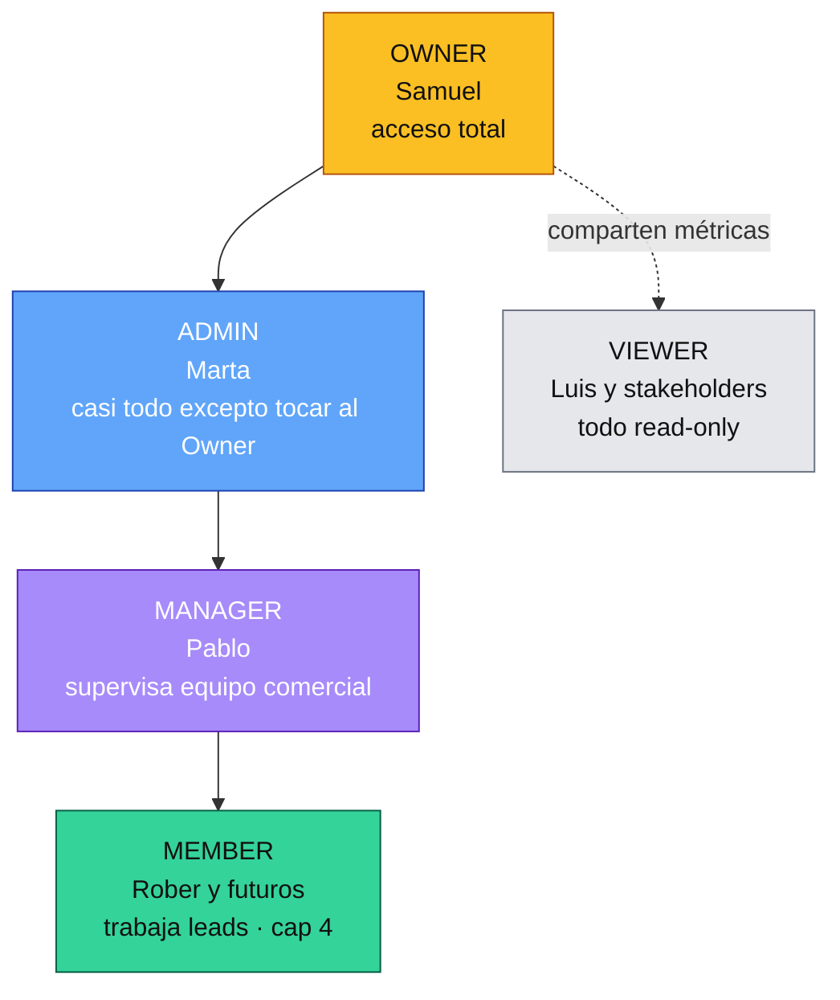
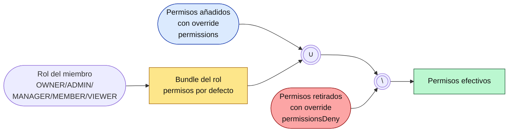

# Meembly Admin — Índice operacional

Guías por rol para el equipo interno Meembly. Si te preguntas quién eres, mira la tabla de abajo y abre tu guía.

**¿Acabas de entrar al equipo?** Empieza por [onboarding-comercial.md](./onboarding-comercial.md) — te lleva del día 1 al primer cierre real. Luego usa las guías por rol como referencia.

## Quién es quién

| Persona | Rol | Guía |
|---|---|---|
| Samuel Dávila | Owner | [role-owner.md](./role-owner.md) |
| Marta | Admin | [role-admin.md](./role-admin.md) |
| Pablo Salcedo | Manager | [role-manager.md](./role-manager.md) |
| Roberto y futuros comerciales | Member | [role-member.md](./role-member.md) |
| Luis Escobar y otros stakeholders externos | Viewer | [role-viewer.md](./role-viewer.md) |

## Qué puede hacer cada rol (resumen)

| Área | Owner | Admin | Manager | Member | Viewer |
|---|:-:|:-:|:-:|:-:|:-:|
| Ver leads | Todos | Todos | Del equipo | Propios | Todos (read) |
| Editar leads | ✓ | ✓ | — | Propios | — |
| Asignar leads / ver pool | ✓ | ✓ | — | — | — |
| Pipeline (ver/mover) | ✓ / ✓ | ✓ / ✓ | Ver equipo | Ver propios / mover propios | Ver / — |
| Enviar email, WA, IG | ✓ | ✓ | ✓ | ✓ | — |
| Prospectos (pre-funnel) | ✓ | ✓ | — | — | — |
| Clubes (panel Activos/Onboarding/Renovaciones) | ✓ | ✓ | ✓ | — | — |
| Crear club | ✓ | ✓ | — | — | — |
| Customer Success (salud clientes) | ✓ | ✓ | ✓ | — | — |
| Marketing (proponer contenido a clubes, publicar Meembly) | ✓ | ✓ | — | — | — |
| Soporte — ver conversaciones | ✓ | ✓ | ✓ | ✓ | ✓ |
| Soporte — aprobar drafts, editar KB | ✓ | ✓ | — | — | — |
| Instancias Odoo (SPA/MPS/PM/YVR) — ver | ✓ | ✓ | ✓ | ✓ | ✓ |
| Instancias Odoo — gestionar | ✓ | ✓ | — | — | — |
| Equipo (invitar, cambiar rol, overrides) | ✓ | ✓ | — | — | — |
| Objetivos (ver/editar) | ✓ / ✓ | ✓ / ✓ | ✓ / — | ✓ / — | ✓ / — |
| Métricas | ✓ | ✓ | ✓ | ✓ | ✓ |
| Auditoría (log del equipo Meembly) | ✓ | ✓ | — | — | — |

El Owner puede dar permisos extra a personas concretas (add) o quitar permisos del bundle (deny) desde **Equipo → editar miembro**. Lo explica [role-owner.md](./role-owner.md).

### Permisos efectivos — cómo se calculan

Regla: **deny siempre gana**. Si un permiso está en el bundle del rol y también en `permissionsDeny`, queda denegado.

## ¿Cómo hago X? — Índice por tarea

### Trabajar un lead
- Recibir uno del pool → [Member §Flujo 1](./role-member.md#flujo-1--recibir-un-lead-del-pool) · [Admin §Repartir pool](./role-admin.md#repartir-el-pool)
- Mover stage (NEW → CONTACTED → QUALIFIED → DEMO → PROPOSAL) → [Member §Flujo 2](./role-member.md#flujo-2--trabajar-el-lead-hasta-cerrarlo)
- Cerrar lead (WON / LOST) → [Member §Flujo 2](./role-member.md#flujo-2--trabajar-el-lead-hasta-cerrarlo)
- Devolver lead al pool → [Member §Devolver al pool](./role-member.md#devolver-un-lead-al-pool)
- Ver mis slots (n/4) → [Member §Cap de 4 leads](./role-member.md#cap-de-4-leads)
- Enviar email / WhatsApp / IG / llamada → [Member §Composer](./role-member.md#composer-envía-comunicaciones-sin-salir-del-lead)

### Comercial desde arriba (Manager/Admin/Owner)
- Ver actividad del equipo → [Manager §Pipeline y actividad](./role-manager.md#pipeline-y-actividad-del-equipo)
- Métricas / ranking → [Manager §Métricas](./role-manager.md#métricas)
- Editar objetivos comerciales → [Admin §Objetivos](./role-admin.md#objetivos) · [role-owner.md](./role-owner.md)

### Equipo
- Invitar comercial nuevo → [Admin §Invitar](./role-admin.md#invitar-a-alguien-al-equipo)
- Ajustar permisos a una persona (add/deny) → [Owner §Overrides](./role-owner.md#overrides-add--deny)
- Cambiar rol de un miembro → [Owner §Cambiar rol](./role-owner.md#cambiar-el-rol-de-alguien)
- Desactivar miembro → [Admin §Desactivar](./role-admin.md#desactivar-un-miembro)

### Clubes
- Ver clubes activos / salud / renovaciones → [Manager §Panel clubes](./role-manager.md#panel-clubes) · [Admin §Panel clubes](./role-admin.md#panel-clubes-activos--onboarding--renovaciones)
- Crear un club nuevo desde admin → [Admin §Crear club](./role-admin.md#crear-un-club-nuevo)
- Convertir un lead ganado en club → [Admin §Convertir lead](./role-admin.md#convertir-un-lead-ganado-en-club)

### Prospectos (pre-funnel)
- Registrar prospecto B2B → [Admin §Prospectos](./role-admin.md#prospectos-pre-funnel)
- Convertir prospecto en lead → [Admin §Prospectos](./role-admin.md#prospectos-pre-funnel)

### Marketing
- Aprobar y publicar post Meembly (IG propio) → [Admin §Marketing Meembly](./role-admin.md#marketing-meembly-publicación-manual-desde-admin)
- Proponer contenido a un club cliente → [Admin §Marketing clubes](./role-admin.md#marketing-proponer-contenido-a-un-club)

### Soporte
- Aprobar / editar / rechazar un draft de IA → [Admin §Soporte](./role-admin.md#soporte-aprobar-drafts-de-ia)
- Añadir corrección a la KB → [Admin §Soporte](./role-admin.md#soporte-aprobar-drafts-de-ia)
- Ver conversaciones (read-only) → [Viewer §Soporte](./role-viewer.md#soporte-read-only)

### Infraestructura
- Conectar tu Gmail personal (para enviar emails desde tu identidad) → [Admin §Gmail](./role-admin.md#conectar-tu-gmail-personal) · [Member §Gmail](./role-member.md#conectar-tu-gmail-personal)
- Revisar instancias Odoo con error → [Admin §Instancias](./role-admin.md#instancias-odoo) · [Owner](./role-owner.md)
- Ver auditoría del equipo → [Admin §Auditoría](./role-admin.md#auditoría) · [Owner](./role-owner.md)

### Notificaciones pendientes
- Ver leads con actividad entrante sin atender → [Member §Pendientes](./role-member.md#pendientes-bandeja-de-actividad-entrante) · [Manager §Pendientes](./role-manager.md#pendientes-del-equipo)
- Marcar una actividad como gestionada → idem

## Convenciones

- **Meembly** = app de cliente (dueños de clubes). URL: `/[locale]/dashboard/...`.
- **Meembly Admin** = este panel interno. URL: `/[locale]/admin/...`.
- Todas las guías asumen que has entrado en `/admin` y que tu sesión está activa.
- Si ves "Acceso restringido" y crees que es un error, escalas al Owner (Samuel).

## Screenshots

Los screenshots de cada pantalla viven en `docs/ops/screenshots/`. Si un screenshot está desactualizado o falta, abre un issue o avisa a Samuel.

## ¿Quieres cambiar algo en estas guías?

Editar directamente en `docs/ops/*.md` y proponer cambios como PR. El owner de estas guías es Samuel.
