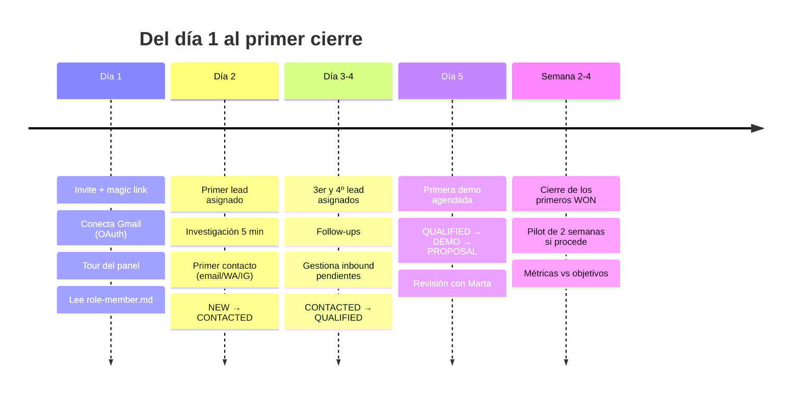
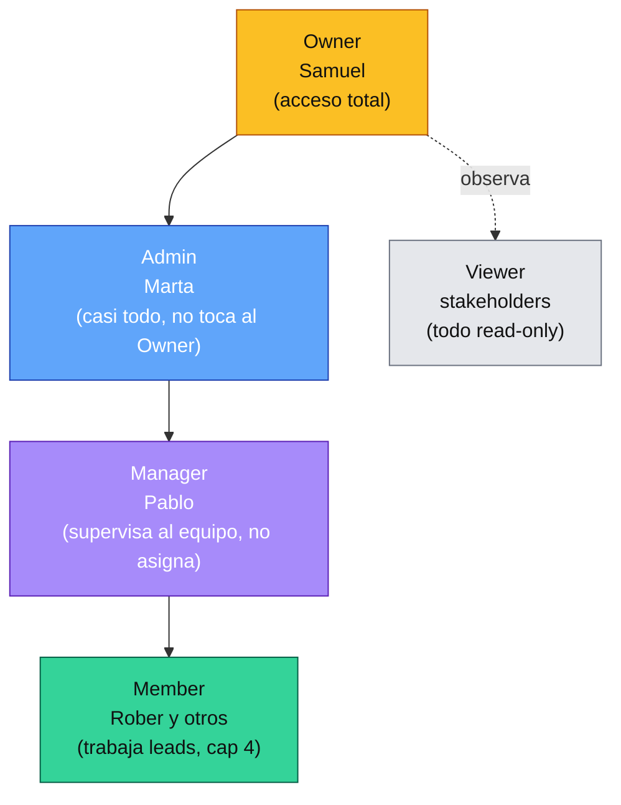
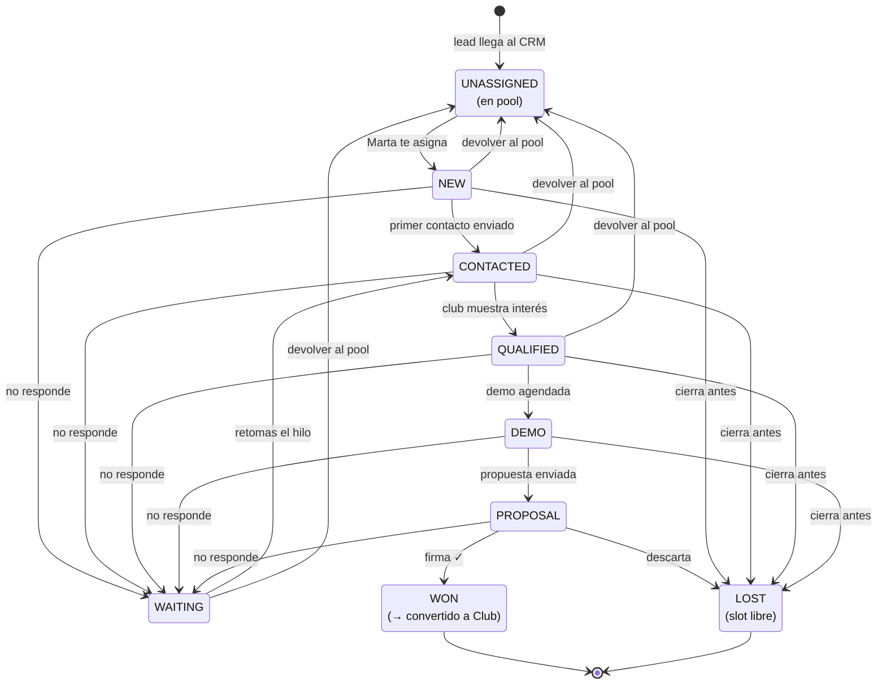
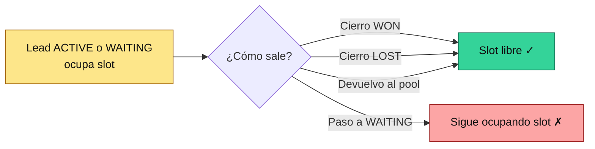
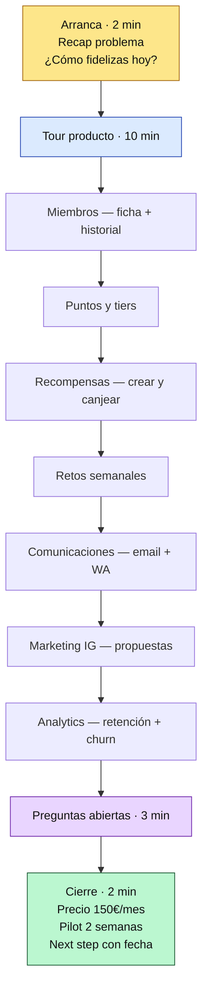
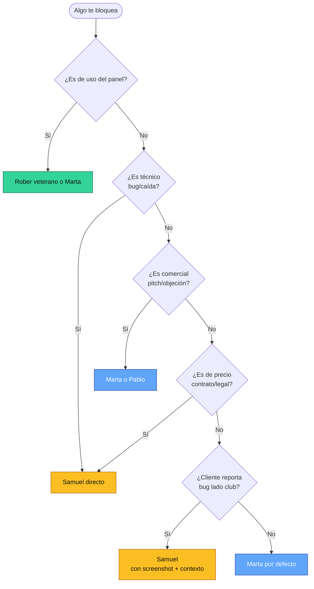

# Onboarding del comercial — primera semana en Meembly

Guía para cualquier persona que empieza mañana en el equipo comercial. Léela entera el día 1 (te lleva 30-40 min). Luego usa [role-member.md](./role-member.md) como referencia rápida durante el resto del trabajo.

Convenciones:
- **Meembly** = la app que vende nuestro producto a los clubes. La usa el dueño/manager del club.
- **Meembly Admin** = tu panel interno. Aquí vives tú y el resto del equipo.
- Cualquier cosa marcada `[borrador]` viene de defaults que he puesto yo — valídalo con Samuel antes de decírselo a un cliente.

### Mapa de tu primera semana

### Mapa de roles del equipo

---

## 1. Qué vendes, a quién y por cuánto

### Producto

**Meembly** es una plataforma de fidelización para clubes deportivos. Le das al dueño del club las herramientas para que sus socios vuelvan más, gasten más y hablen bien del club — todo en un solo sitio.

Qué incluye (visto desde el dueño del club):

- **Miembros**: alta, edición, historial, niveles (tiers), puntos, check-in, consumo.
- **Recompensas y retos**: el dueño define premios (horas gratis, merchandising, clases, etc.) y retos (gana X puntos si vienes 3 veces esta semana) para que el socio tenga razones para volver.
- **Comunicaciones**: envío de campañas por email, WhatsApp, con segmentos (activos/inactivos, por tier, por deporte). Plantillas listas.
- **Marketing para IG del club**: Meembly le propone contenido listo para Instagram (Meembly Admin lo prepara, el club lo publica manualmente desde su cuenta).
- **Analytics**: KPIs de retención, engagement, revenue por socio, churn.
- **Integraciones**: sincroniza con su Odoo (según instancia — SPA, MPS, PM, YVR), con WhatsApp Business, con Instagram DMs, con pasarelas de pago. Si ya tiene Playtomic para reservas, los check-ins se pueden cruzar.
- **Auditoría interna del club**: log de todo lo que hace el staff (altas, validaciones, edición de recompensas, redenciones).

### Target

Clubes deportivos medianos en Europa:

- **Pádel** (el grueso hoy — mucho club nuevo sin CRM real).
- **Tenis, fútbol indoor, crossfit, gimnasios boutique**, estudios de yoga/pilates.
- Tamaño típico: 200-2.000 socios activos, 1-4 sedes.
- Tomador de decisión: dueño, general manager, o responsable de marketing si el club es grande.

Quién **no** es target hoy:

- Cadenas grandes con ERP propio (demasiada fricción de integración).
- Clubes muy pequeños (< 100 socios) — el ROI no les compensa.
- Clubes sin digitalización previa (no tienen ni base de datos de socios exportable) — les vendemos, pero la implantación es larga.

### Precio

- **Base: 150€/mes**. Incluye la plataforma completa para un club.
- **Extras aparte**: `[borrador — preguntar a Samuel por la lista exacta de add-ons (IG auto-post, soporte premium, onboarding asistido, integraciones custom, etc.) y sus precios]`.
- No hay comisiones por transacción.
- Contrato estándar: `[borrador — mensual con permanencia X meses? Anual? Confirmar con Samuel]`.

### Pitch en una frase

> **"Fideliza a tus clientes, diferénciate del resto de clubes."**

Esa es la línea. Todo lo demás se desarrolla en base a eso.

### Tres puntos de valor (para desarrollar el pitch)

1. **Retención**: un socio que vuelve vale 10× uno nuevo. Meembly te da las herramientas para que vuelva sin que tengas que perseguirlo.
2. **Diferenciación**: tu competencia (el club de al lado) tiene web, reservas y pago. Nadie tiene un programa de fidelización serio. Tú sí.
3. **Operativa**: dejas de depender de Excels y WhatsApps sueltos. Centralizas comunicación, recompensas, métricas y análisis en una sola herramienta.

---

## 2. Tu primer día (día 1)

### Setup técnico — 45 min

1. **Recibes invite**: Samuel o Marta te envía un email con magic link para entrar a Meembly Admin. Click → aceptas → entras a `/admin`.

    *(pendiente de capturar)*

2. **Revisa tu rol**: arriba a la derecha ves tu nombre y rol (Member). Si dice otra cosa, avisa a Marta.

3. **Conecta tu Gmail personal**: sidebar → **Ajustes → Email**. Click en "Conectar Gmail" → OAuth con Google → autorizas. A partir de aquí, cada email que mandes desde un lead sale desde tu dirección (no desde el genérico).

    *(pendiente)*

4. **Verifica tu identidad en Meembly Admin**:
   - Sidebar → **Ajustes → Perfil**. Sube foto, completa nombre y teléfono.

5. **WhatsApp y IG**: estas conexiones son del admin global, no personales. No las tocas tú — ya están activas. Si al mandar un WA o IG ves "no conectado", avisa a Samuel.

### Tour guiado del panel

Con la guía [role-member.md](./role-member.md) abierta en paralelo, recorre cada entrada de tu sidebar:

| Sidebar entry | Para qué | Léelo en | 
|---|---|---|
| Home | Tus KPIs personales, próximos pasos. | [role-member §Home](./role-member.md#qué-ves-al-entrar) |
| Mis leads | Tus 4 leads activos. | [role-member §Flujo 2](./role-member.md#flujo-2--trabajar-el-lead-hasta-cerrarlo) |
| En espera | Leads con respuesta pendiente del club. | [role-member §WAITING](./role-member.md#en-espera-waiting) |
| Pendientes | Leads con inbound sin atender. | [role-member §Pendientes](./role-member.md#pendientes-bandeja-de-actividad-entrante) |
| Pipeline | Tu Kanban de deals. | [role-member §Pipeline](./role-member.md#pipeline) |
| Actividad | Tu feed de lo que has enviado y recibido. | — |
| Métricas | KPIs globales del equipo (no filtradas por tu scope). | — |
| Soporte | Read-only. Para enterarte de qué problemas tienen los clubes. | — |
| Objetivos | Tus metas mensuales/trimestrales. | — |
| Instancias | SPA/MPS/PM/YVR — informativo. | — |
| Ajustes | Tu cuenta + email OAuth. | — |

### Entiende el cap de 4 leads

Lee esta sección dos veces: [role-member §Cap de 4 leads](./role-member.md#cap-de-4-leads).

Es el hecho más importante de tu día a día:
- Nunca tendrás más de 4 leads activos.
- `ACTIVE` y `WAITING` cuentan. `WON/LOST/UNASSIGNED` no.
- Si estás a 4/4, Marta no puede asignarte otro.
- La forma de liberar: cierras uno (WON/LOST) o lo devuelves al pool.

Regla mental: **si un lead no avanza en 2 semanas, decide. No acumules.**

### Lectura obligatoria

- [role-member.md](./role-member.md) — tu guía de referencia.
- Este documento hasta el final.
- [admin-index.md](./admin-index.md) — solo la matriz resumida, para que entiendas quién puede hacer qué.

### Al final del día 1

- Gmail conectado.
- Tour del panel terminado.
- Cap de 4 leads entendido.
- Sabes a quién escalar qué (ver sección 7 de este doc).

---

## 3. Días 2 a 5 — tu primer lead real

### Día 2 — recibes el primer lead

Marta te asigna 1 lead del pool. Lo notas porque:
- Tu contador "Mis leads activos" sube de 0/4 a 1/4.
- Aparece en `/admin/dashboard/leads`.

**Pasos para arrancarlo**:

1. **Abre el lead** (click en la fila).
2. **Lee todo lo que hay**:
   - Identidad (club, ciudad, IG, deporte, instancia Odoo).
   - Timeline: ¿alguien ya ha contactado? ¿Qué ha dicho el club? Scroll hasta el fondo.
   - Deal: stage actual (probable `NEW`), MRR potencial, owner (tú).
3. **Investiga 5 min antes del primer contacto**:
   - IG del club: cuántos seguidores, qué publican, actividad.
   - Web: ¿tienen ya reservas online? ¿Pasarela de pago? ¿Newsletter?
   - Google Maps: reseñas, horario, pistas.
4. **Primer contacto**. Por orden de preferencia:
   - **Email** (si tienes email directo del dueño). Composer → tab Email → plantilla `[borrador — crear plantilla "primer contacto" con Samuel]` → personaliza 2 líneas → enviar.
   - **WhatsApp** (si tienes número). Composer → tab WhatsApp.
   - **IG DM** (si lo anterior falla).
   - **Llamada** (último recurso; registra la conversación en la pestaña Llamada).
5. **Mueve el stage**: del lead o del deal, pasa de `NEW` a `CONTACTED`.

 *(pendiente)*

### Día 3-4 — segundo y tercer lead

Marta te irá llenando a 3/4 o 4/4. Mismo flujo. En paralelo vas atendiendo respuestas entrantes.

**Cuando el club responde** (email, WA, IG):
- Aparece en `/admin/dashboard/leads/pending`.
- Abres el timeline, respondes desde el composer, y marcas la actividad entrante como **gestionada** (botón en la actividad).
- Si en la respuesta el club muestra interés real (pregunta por precio, pide demo, dice "me interesa"), mueve el deal a `QUALIFIED`.

**Cuando no responde en 3-5 días**:
- Un follow-up por otro canal (si le escribiste por email, ahora WhatsApp).
- Si sigues sin respuesta en 1 semana: `WAITING` con `awaitingUntil` a 7-14 días vista. Queda en espera; sigue ocupando slot.

### Día 5 — primera demo

Si consigues demo:
- Stage → `DEMO`.
- Agenda la demo por email/WA (15-20 min, zoom o Google Meet).
- Usa el guion de la sección 5.
- Post-demo: mueve a `PROPOSAL` si han pedido propuesta, o a `LOST` si ha dicho que no.

### Qué esperar (realista)

Con 4 leads en paralelo y siendo tu primera semana:
- 4 primeros contactos enviados.
- 2-3 respuestas recibidas (algunos ignoran).
- 1-2 demos agendadas (puede que sean la semana 2).
- 0-1 cierres WON en la primera semana (normal; el ciclo es 2-6 semanas).

No te agobies si no cierras el día 5. La clave es **mantener el pipeline en movimiento**.

---

## 4. Flujo completo de un lead (referencia)

### Ciclo de vida

### Qué libera el slot (cap 4)

Regla mental: **WAITING no libera**. Si acumulas 4 en WAITING, estás bloqueado aunque "no estés trabajando activamente". Decide siempre: retomar, cerrar LOST, o devolver al pool.

---

## 5. Pitch y demo — guion base

**`[borrador — validar con Samuel]`**

### Elevator pitch (30 segundos, para WhatsApp/email frío)

> "Hola [nombre], soy [tu nombre] de Meembly. Ayudamos a clubes como el tuyo a fidelizar a sus socios con un programa de puntos, recompensas y retos integrado con tu CRM (Odoo/Playtomic). En 2 semanas tus socios más activos ganan razones para volver más a menudo, y tú diferencias tu club del de al lado. ¿Puedo enseñarte cómo funciona en 15 minutos esta semana?"

### Pitch extendido (3 min, para llamada)

1. **Quiénes somos** (10 seg): Meembly, plataforma de fidelización específica para clubes deportivos.
2. **Problema que resolvemos** (30 seg): la mayoría de clubes no tienen programa de fidelización real — solo horas sueltas, alguna oferta de Navidad, WhatsApps manuales. Los socios vienen, pagan, se van. No hay razón para que vuelvan más que la pista disponible.
3. **Cómo lo resolvemos** (90 seg): puntos por cada visita/compra/reserva + recompensas canjeables + retos semanales + comunicación segmentada + analytics de retención. Todo integrado con tu Odoo/Playtomic, cero doble input.
4. **Diferenciación** (30 seg): tu competencia no tiene esto. Los socios que entran a tu programa se quedan porque hay razón para volver y porque están ganando "algo" por cada visita.
5. **Cierre** (20 seg): 150€ al mes, sin comisiones por transacción. Te doy 2 semanas de pilot si encajamos. ¿Tenemos 15 min este jueves?

### Guion de demo (15-20 min)

Nunca cierres sin fecha para siguiente contacto.

### Objeciones típicas y respuestas

**`[borrador — todas estas son defaults plausibles, repásalas con Samuel antes de usarlas en vivo]`**

| Objeción | Respuesta base |
|---|---|
| "150€/mes es caro." | Un socio perdido son ~[X]€ de cuota anual. Con que Meembly recupere 1-2 socios al mes ya se paga sola. Plus: sin comisiones de transacción, fijo mensual. |
| "Ya tengo CRM (Playtomic/Odoo)." | Perfecto — Meembly se integra con tu CRM existente. No es un reemplazo, es la capa de fidelización encima. Los socios y las reservas siguen viviendo donde ya están. |
| "Mis socios no usan apps." | Meembly no requiere app del socio en esta versión — el dueño gestiona desde Meembly, comunica por WA/email, el socio recibe la experiencia sin instalar nada. |
| "¿Y la implantación cuánto tarda?" | Onboarding típico: 1-2 semanas. Importamos tus socios desde Odoo, configuramos tu programa de puntos/recompensas, conectamos WhatsApp, y listo. |
| "Ya intenté un programa de puntos y no funcionó." | ¿Qué falló? (escucha). La mayoría de programas caseros mueren porque el dueño no puede mantenerlos manualmente. Meembly automatiza la parte tediosa: los puntos se ganan solos al reservar/pagar, las recompensas se canjean con un QR, los retos se generan cada lunes. |
| "¿Quién da soporte?" | Tenemos soporte con respuesta en <24h por email/chat. Además, tu onboarding incluye [borrador — confirmar con Samuel si hay llamadas de seguimiento estructuradas]. |
| "¿Puedo probarlo antes de firmar?" | Te damos 2 semanas de pilot con tu propio club, tus socios reales, sin permanencia. Si al final no te convence, no hay factura. |
| "¿Y si quiero salir?" | Contrato mensual `[borrador — confirmar plazos]`. Te llevas tu export de datos siempre. |
| "Es mucha tecnología para mi equipo." | El panel está pensado para que una persona sin background técnico lo use en 1 hora. Si hace falta, estamos para ayudar. La parte compleja (integración con Odoo, WhatsApp Business API) la hacemos nosotros. |
| "Mi club es pequeño (<100 socios)." | Honestamente, hasta 100 socios el ROI es ajustado. Te lo digo claro antes de que gastes tiempo: cuando crezcas a 150+ tiene mucho más sentido. `[borrador — alinear con Samuel si cerramos clubes pequeños]`. |

---

## 6. Meembly (la app del cliente) — lo que ve el dueño

Para vender bien tienes que haber navegado la app del dueño. Pide a Marta acceso a una instancia demo `[borrador — confirmar cuál es el entorno de demo que se enseña a prospects]`.

Lo que ve el dueño cuando entra a `/[locale]/dashboard`:

| Sección | Para qué le sirve |
|---|---|
| **Home** | Vista global: socios activos, puntos otorgados esta semana, próximas campañas. |
| **Miembros** | Alta, edición, ficha completa del socio. Historial de visitas, puntos, redenciones. |
| **Tiers** | Niveles (bronce/plata/oro) con sus beneficios y umbrales. |
| **Puntos** | Reglas de puntos: +X por reserva, +Y por compra en bar, +Z por traer amigo. |
| **Recompensas** | Catálogo de premios canjeables. Desde horas gratis hasta merchandising. |
| **Retos (challenges)** | Retos semanales/mensuales. "Ven 3 veces esta semana y gana 50 puntos extra". |
| **Check-in** | Pantalla en recepción: QR del socio, alta puntos automática. |
| **Comunicaciones** | Campañas email + WhatsApp, con segmentación. |
| **Eventos** | Eventos del club (torneos, clinics, parties). Inscripción, aforo, pago. |
| **Partners** | Acuerdos con partners locales (fisio, tienda deportiva) para cross-promo. |
| **Coupons** | Cupones de descuento con código y vigencia. |
| **Gym** | Si el club es gimnasio: clases, reservas, profes. |
| **Marketing** | Recibe propuestas de contenido IG que Meembly Admin fabrica. Descarga, copia, publica manualmente. |
| **Notificaciones** | Configura qué se manda automáticamente al socio (cumpleaños, punto hito, inactividad). |
| **Analytics** | KPIs: retención, churn, LTV por tier, revenue. |
| **Audit log** | Todo lo que hace el staff del club — trazabilidad. |
| **Ajustes** | Branding (logo, colores), WhatsApp, email, integraciones. |

 *(pendiente)*

---

## 7. Contactos de escalado

Casos concretos:

| Qué ocurre | A quién |
|---|---|
| Duda de uso del panel admin | Rober veterano → Marta → Samuel |
| Duda comercial (cómo priorizar, qué decir) | Marta / Pablo (Manager) |
| Bug técnico del admin (no carga, botón roto) | Samuel |
| Sesión Gmail/WA caída | Ajustes → reconectar. Si no va, Samuel |
| Necesitas un lead más y estás a 3/4 | Marta |
| Lead que el club no responde hace 3 semanas | Ciérralo LOST o devuélvelo al pool. No consultar. |
| Cliente reporta bug en su Meembly (lado club) | Pásalo a Samuel con screenshot + contexto. Nunca prometas fix sin consultar. |
| Petición de precio custom/descuento | Samuel (nunca tú) |
| Petición de contrato custom/legal | Samuel |
| Cliente muy técnico pregunta detalles de integración | Samuel |
| Quieres acceso a algo que no ves (pool, prospectos) | Marta / Samuel |

---

## 8. Primer mes — qué se espera de ti

**Semana 1**: onboarding + 4 leads arrancados.
**Semana 2**: primeros follow-ups, 1-2 demos.
**Semana 3**: 1-2 propuestas enviadas, primer WON probable.
**Semana 4**: revisión con Marta. Ajuste de objetivos si hace falta.

Métricas en las que te mides:
- Leads trabajados (objetivo: cero parados >2 semanas).
- Tasa de contacto (primer email/WA <48h desde asignación).
- Tasa de conversión por stage (NEW→CONTACTED, CONTACTED→QUALIFIED, QUALIFIED→DEMO, DEMO→PROPOSAL, PROPOSAL→WON).
- Tiempo de ciclo (días de NEW a WON/LOST).

Todos visibles en sidebar → **Métricas** y **Objetivos**.

---

## 9. Reglas no negociables

1. **Nunca** prometas un precio distinto a 150€ sin confirmar con Samuel.
2. **Nunca** comprometas una feature que el producto no tiene. Si te preguntan y no sabes, "te confirmo mañana" es una respuesta válida.
3. **Nunca** ignores un inbound pendiente más de 48h. Si no puedes atenderlo (vacaciones, enfermedad), avisa a Marta para que lo reasigne.
4. **Siempre** documenta en el timeline del lead. Si no está en el timeline, no ha pasado.
5. **Siempre** mueve el stage del deal cuando cambie. Un lead en `NEW` que ya ha hecho demo es ruido para todo el equipo.
6. **Siempre** registra una llamada que hagas con el móvil — pestaña Llamada del composer. Notas + duración + outcome.

---

## 10. Qué leer después

Cuando termines esta guía:

- [role-member.md](./role-member.md) — referencia del día a día.
- [admin-index.md](./admin-index.md) — matriz de permisos y navegación por tarea.

---

*Guía mantenida por Samuel. Si detectas algo desactualizado o mal explicado tras tu experiencia real, abre un issue o propón un PR directo — esta guía se afina con cada comercial nuevo que entra.*
