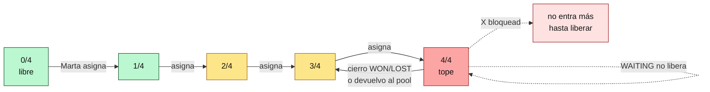

# Guía del Member — el comercial (Roberto y los que vengan)

Eres el que trabaja los leads. Tu panel está orientado a ejecutar: abrir un lead, hablar con el club, moverlo por las etapas, cerrarlo. No gestionas a nadie y ves solo lo tuyo.

Si buscas una tarea concreta, empieza por el [índice](./admin-index.md).

## Qué ves al entrar

URL: `/admin`.

- **Home**: "Hola, {tu nombre}". KPIs **tuyos**: "Mis leads activos (n/4)", "En espera", "Pipeline MRR". No ves el tile "Pool sin asignar". Próximos pasos (instancias Odoo, Gmail, etc.) si aplica.
- **Sidebar**: Home · Buscar · Mis leads (y dentro: En espera, Pendientes — **no** Pool) · Pipeline · Actividad · Métricas · Soporte · Objetivos · Instancias · Ajustes.

## Cap de 4 leads

Regla fuerte: no puedes tener más de **4 leads activos al mismo tiempo**.

Cuentan como activos los leads con stage `ACTIVE` o `WAITING`. No cuentan `UNASSIGNED`, `WON`, `LOST`.

Liberación de slot (automática o manual):

- Cierras el lead con `WON` o `LOST` → libera (automático).
- Devuelves el lead al pool → libera.
- `WAITING` (el club no te responde y lo pones en "volver a intentar en N días") **no libera**. Sigue contando.

Card "n/4 slots ocupados" visible en `/admin/dashboard/leads`. Si estás a 4, no puedes recibir otro — lo sabe Marta, ella libera o espera.

Regla de diseño: ni Admin ni Owner pueden forzar una 5ª asignación. Es intencional.

## Cómo funciona tu "scope"

Solo ves lo tuyo:

- **Leads, deals, actividad** — únicamente los que tienes asignados (`current: true`).
- **Pipeline Kanban** — solo tus deals.
- **Actividad (feed)** — solo tus actividades.
- **Pendientes** — solo tus leads con actividad entrante sin atender.

No ves el pool, no ves leads de otros comerciales, no ves prospectos. Si necesitas algo de ahí, se lo pides a Marta.

## Tu trabajo diario

### Flujo 1 — Recibir un lead del pool

Marta (o Samuel) te asigna un lead desde el pool. Lo notas porque:

- El contador "Mis leads activos" sube (por ejemplo de 3/4 a 4/4).
- Aparece en `/admin/dashboard/leads` (Mis leads).
- Si tienes notificaciones entrantes (p.ej. emails/WA del club), aparecen en `/admin/dashboard/leads/pending`.

El lead viene con stage `ACTIVE`. Tu reloj empieza.

### Flujo 2 — Trabajar el lead hasta cerrarlo

Abre el lead → `/admin/dashboard/leads/[id]`.

La página tiene tres zonas:

1. **Identidad**: nombre del club, ciudad, contacto, IG, instancia Odoo, etc. Botón **Editar** (gate `crm.leads.write` que sí tienes).
2. **Deal**: la oportunidad comercial asociada (stage, MRR, one-time, owner). Tú puedes mover su stage.
3. **Timeline + Composer**: todas las actividades del lead + cajón de texto abajo para enviar email/WA/IG o registrar una llamada.

Stages estándar del deal: `NEW → CONTACTED → QUALIFIED → DEMO → PROPOSAL → WON / LOST`.

Cerrar:

- Cierre ganado → stage `WON` + `outcome = WON`. Libera tu slot automáticamente. El lead queda "ganado" — Marta lo convierte en Club desde el botón "Convertir prospecto → Club" (tú solo cierras; convertir es del Admin).
- Cierre perdido → stage `LOST` + `outcome = LOST` (o `NOT_INTERESTED`, `NOT_A_FIT`, etc.). Libera slot.

### Devolver un lead al pool

En el detalle del lead, botón **Devolver al pool** (lo ves siempre que el lead esté asignado a ti).

- Razón: "el club no responde", "no es perfil", "me falta bandwidth", lo que sea.
- Status: el assignment pasa a `current: false` con `releaseReason: user_released`. El lead vuelve al pool (`stage: UNASSIGNED`). Tu slot queda libre.

No es un drama — es mejor devolver que acumular leads parados.

### Composer: envía comunicaciones sin salir del lead

En la página de detalle, abajo, hay pestañas: **Email · WhatsApp · IG DM · Llamada · Nota**.

- **Email**: requiere que hayas conectado tu Gmail (Ajustes → Email). El email sale desde tu dirección.
- **WhatsApp**: requiere que haya conexión WA del admin (`AdminWhatsApp`). Envío en background vía daemon.
- **IG DM**: idem, vía daemon `instagrapi`.
- **Llamada**: aquí solo registras que has hablado — llamar se hace desde tu móvil o desde Ringover. Las llamadas entrantes de Ringover aparecen aquí solas vía webhook.
- **Nota**: texto libre, no se envía a nadie. Útil para dejarte recordatorios.

Cada envío entra en el timeline y, si es saliente, no genera "pendiente". Si el club te responde (email/WA/IG entrante, llamada perdida), se marca como `direction: IN` + `pendingResolution: true` y aparece en tu bandeja de pendientes hasta que la marques como gestionada.

### Pendientes — bandeja de actividad entrante

Sidebar → **Mis leads → Pendientes**. Lista tus leads con actividad entrante sin atender.

En el timeline del lead, cada actividad entrante pendiente tiene botón **Marcar gestionado**. Cuando hayas respondido (email, WA, IG, llamada), la marcas → la bandeja se limpia. Decide con criterio: "gestionado" no quiere decir "resuelto", quiere decir "he tomado acción".

### En espera (WAITING)

Si has contactado al club y estás esperando respuesta X días, pones el lead en `WAITING`. Aparece en `/admin/dashboard/leads/waiting`. Sigue ocupando tu slot.

Al pasar la `awaitingUntil`, el lead se muestra como "vencido" — hay que decidir: reintentar, cerrar como LOST, devolver al pool.

### Pipeline

Sidebar → **Pipeline**. Kanban con **solo tus deals**. Puedes mover tarjetas entre stages con drag. Al soltar en WON/LOST, se te pide outcome y se libera el slot del lead.

### Métricas

Sidebar → **Métricas**. Todos los roles ven las globales. Útil para comparar cómo vas vs. el equipo y vs. tus objetivos.

### Buscar

Sidebar → **Buscar**. Solo te devuelve leads tuyos (el scope se aplica también aquí). Si buscas un club que no está en tu scope, no aparece — ese lo tiene otro comercial o está sin asignar.

### Conectar tu Gmail personal

Sidebar → **Ajustes → Email**. OAuth con Google. Una vez conectado, los emails del CRM salen desde tu cuenta — importante para evitar spam y personalizar. Si no lo conectas, el composer de email no funciona.

### Soporte (read-only)

Sidebar → **Soporte**. Ves conversaciones que la gente manda a soporte@meembly. **No puedes aprobar drafts** ni editar la KB. Sirve para enterarte de qué problemas tienen los clubes; si ves algo que afecta a un lead tuyo, avisas a Marta o a Samuel.

## Qué NO puedes hacer

- **Ver el pool** (gate `pool.view`): pídele a Marta que te reparta leads.
- **Asignar leads** a ti mismo o a otros: Marta/Samuel.
- **Ver / editar otros leads** que no tengas asignados: tu scope no los incluye.
- **Superar 4 leads activos**: es un tope duro.
- **Ver prospectos** (gate `prospects.view`): son pre-funnel, no los tocas hasta que se convierten en lead.
- **Ver clubes** (gate `clubs.view`): el panel Clubes es post-venta, no es parte de tu día a día.
- **Marketing / Soporte manage / Equipo / Auditoría**: roles superiores.
- **Ver leads de otro comercial**: tu scope te los oculta.

## Cómo escalar

- **Necesitas más leads**: a Marta. Si tu slot está libre, ella te asigna del pool.
- **No puedes con un lead**: devuélvelo al pool directamente; si necesitas coaching previo, a Marta o Pablo (Manager).
- **Bug al enviar email/WA/IG**: a Samuel o Marta. Suele ser un problema de conexión de tu cuenta.
- **El club pide algo que no sabes responder**: soporte tiene KB; si no está, a Samuel.
- **Gmail desconectado / sesión WA expirada**: Ajustes → vuelve a conectar. Si no se deja, a Samuel.

## Lecturas complementarias

- [role-manager.md](./role-manager.md) — lo que Pablo ve de tu trabajo.
- [onboarding-comercial.md](./onboarding-comercial.md) — tu primera semana paso a paso (si aún no la has leído).
- Qué desbloquea Marta (Admin) o Samuel (Owner): pregúntales directamente — tienen guías internas de sus flujos.
