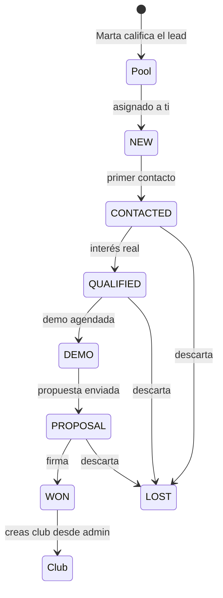

# Guía del rol Venta — closer interno Meembly

Eres el comercial interno de Meembly que cierra ventas enteras: lead frío → demo → propuesta → WON → conversión directa a Club. A diferencia del rol **Postventa** (comercial externo SPA/MPS que solo hace D+0/D+14 en email), tú trabajas el embudo completo y con todos los canales.

Si buscas una tarea concreta, empieza por el [índice](./admin-index.md).

## Canales que tienes

Regla: **todos los canales comerciales están abiertos**.

- **Email**: Gmail personal conectado en Ajustes → Email. Sale desde tu dirección.
- **Llamadas**: Ringover o móvil. Registro en pestaña Llamada del composer; las entrantes llegan solas vía webhook.
- **WhatsApp**: bot compartido de Meembly. Lo usas con criterio — el cliente recibe un mensaje que identifica a "Meembly", no a ti personalmente.
- **Instagram DM**: cuenta `@meembly`. Mismo principio.
- **Notas**: uso interno, no se envían.

Importante: WA e IG son recursos compartidos. Si dos closers mandan en paralelo desde esas cuentas, el club lo nota. Coordínate con Pablo (Manager) si hay solapamiento.

## Qué ves al entrar

URL: `/admin`.

- **Home**: "Hola, {tu nombre}". KPIs personales: "Mis leads activos (n/4)", "En espera", "Pipeline MRR".
- **Sidebar**: Home · Buscar · Mis leads (En espera, Pendientes) · Pipeline · Actividad · Métricas · Soporte · Objetivos · Clubes · Instancias · Ajustes.

A diferencia del rol Postventa, tú **sí** ves el panel **Clubes** (gate `clubs.view`) y puedes crear un club directamente cuando cierras WON (gate `clubs.create`). Así el cliente no espera a que Marta lo convierta — lo aterrizas tú.

## Cap de 4 leads

Igual que el rol Postventa: máximo **4 leads activos** (stage `ACTIVE` o `WAITING`). La misma regla, mismo motivo — el ritmo comercial se rompe por encima de 4 en paralelo.

Liberación de slot:
- Cerrar WON (y convertir a Club) o LOST: libera slot.
- Devolver al pool: libera slot.
- Pasar a WAITING: no libera. Sigue contando.

## Tu scope

Ves solo lo tuyo — igual que Postventa:

- Leads, deals, actividad asignados a ti con `current: true`.
- Pipeline Kanban: solo tus deals.
- Actividad (feed): solo lo que has generado.
- Pendientes: solo tus leads con inbound sin gestionar.

No ves el pool, no ves leads de otros comerciales, no ves prospectos pre-funnel. Si necesitas algo, lo pides a Marta o Pablo.

## Flujo completo (lead frío → Club activo)

### Diferencias con Postventa

| Aspecto | Postventa (MEMBER) | Venta (VENTA) |
|---|---|---|
| Objetivo | Upsell Meembly a cliente SPA/MPS | Cierre frío completo |
| Canales | Email + llamada | Email + WA + IG + llamada |
| Origen leads | Auto-sync Odoo (tag `Postventa`) | Pool asignado por Marta |
| Ritmo | D+0 + D+14 | Todo el embudo (días/semanas) |
| Crear club al WON | ❌ (lo hace Marta) | ✅ |
| Ajustes personales (Gmail) | ✅ | ✅ |

## Cuando cierras WON

1. Mueves el deal a `WON` + outcome `WON`. Slot liberado.
2. En el detalle del lead aparece el botón **Crear club**. Click → abre el wizard de creación (nombre, plan, instancia Odoo asociada, etc.).
3. Una vez creado, Marta recibe notificación para arrancar onboarding. Tu parte termina aquí salvo que el cliente tenga dudas en la primera semana — las puedes responder tú hasta que Marta le asigne customer success.

## Qué NO puedes hacer

- **Ver el pool** (gate `pool.view`): igual que Postventa — pídeselo a Marta.
- **Asignar leads** a ti mismo o a otros: Marta/Samuel.
- **Ver/editar leads de otros comerciales**: scope.
- **Superar 4 activos**: tope duro.
- **Ver prospectos** (gate `prospects.view`): pre-funnel, de Marta.
- **Marketing / Soporte manage / Equipo / Auditoría**: roles superiores.
- **Desasignar a otro comercial de un lead que no sea tuyo**: solo Admin/Manager.

## Cómo escalar

- **Necesitas más leads**: a Marta.
- **Demo complicada / objeción fuerte**: Pablo (Manager) o Samuel.
- **Precio fuera de tabla**: Samuel. Nunca tú.
- **Bug técnico del admin**: Samuel.
- **Gmail / WA / IG no envía**: Ajustes → reconectar. Si no sale, Samuel.
- **Club creado mal / datos incorrectos tras WON**: Marta.

## Lecturas complementarias

- [role-postventa.md](./role-postventa.md) — para entender la diferencia con el comercial externo SPA/MPS.
- [onboarding-comercial.md](./onboarding-comercial.md) — primera semana en Meembly (aplicable a ambos roles comerciales).
- [role-manager.md](./role-manager.md) — lo que Pablo supervisa de tu trabajo.
